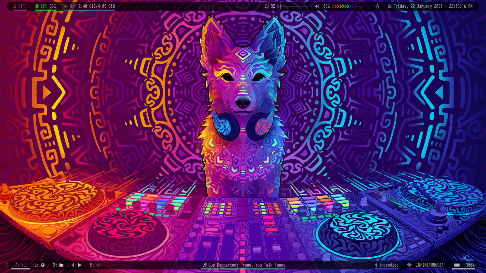
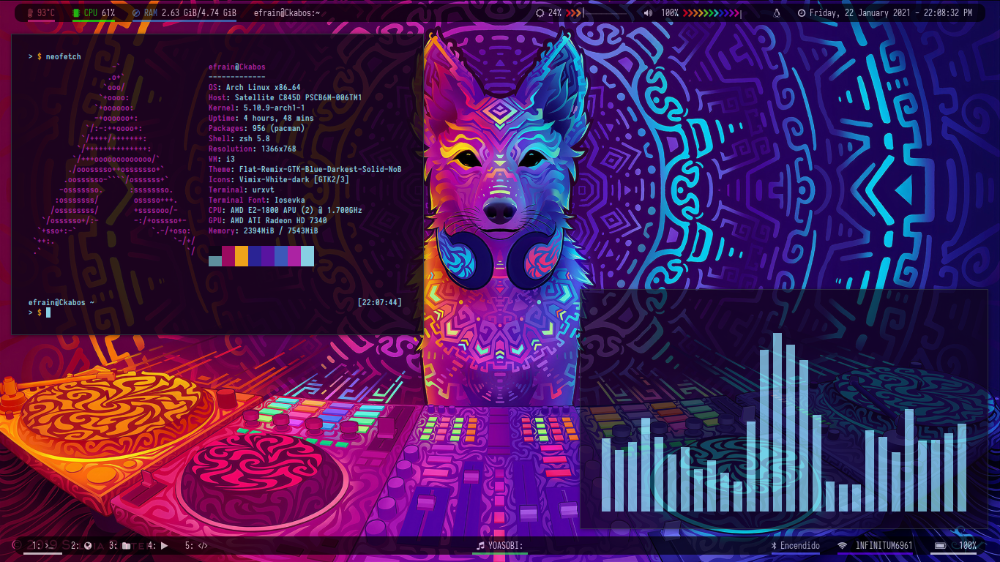
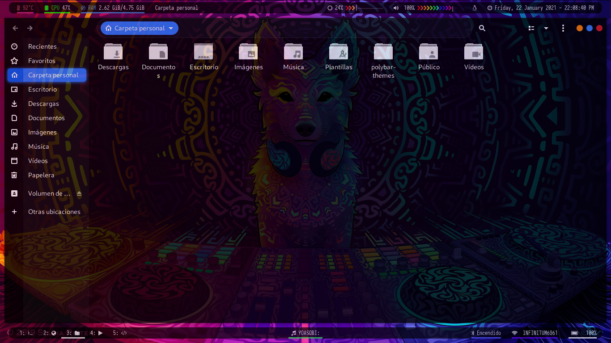
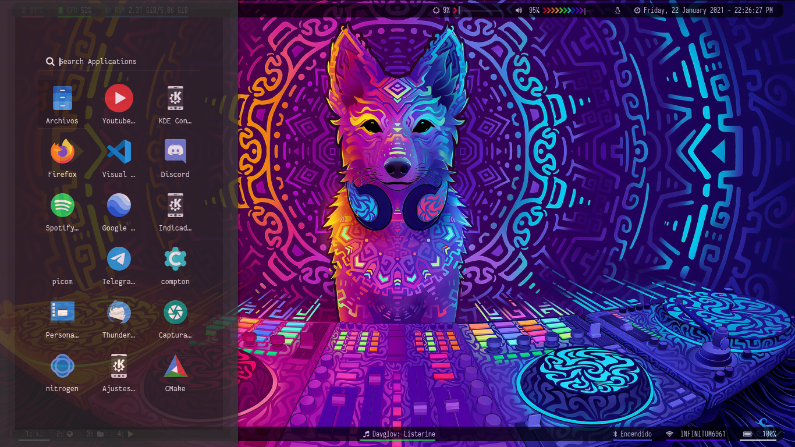

# i3-Polybar-Theme
Algunos comandos o atajos dentro del Window Manager pueden variar, ya que los atajos tanto para customizar el brillo y volumen dependen del teclado.

# Rofi menu

* [rofi-menu](https://github.com/adi1090x/rofi)

# Modulos

- temperature
- spotify
- cpu
- xwindow
- i3
- mpd
- xbacklight
- memory
- wlan
- eth
- date
- pulseaudio
- alsa
- battery
- powermenu
- bluetooth

# Instalacion

* gnome-screenshot
* [lxappearance](http://www.linuxfromscratch.org/blfs/view/svn/lxde/lxappearance.html)
* urxvt
* acpilight
* [nitrogen](https://nitrogenproject.com/)
* zsh
* pulseaudio
* compton
* pavucontrol
* dunst
* playerctl
* [rofi-bluetooth](https://aur.archlinux.org/packages/rofi-bluetooth-git/)

**Window Manager**: [i3](https://i3wm.org/)
**Bar**: [Polybar](https://github.com/jaagr/polybar)
**Terminal**: [URxvt](https://wiki.archlinux.org/index.php/Rxvt-unicode)
**Theme**: [Flat Remix](https://github.com/daniruiz/Flat-Remix)
**Icon-Theme**: [Vimix](https://www.opendesktop.org/p/1273372/)

# Wallpaper Disco Dingo -> Silvia Ritter
https://www.deviantart.com/sylviaritter/art/Disco-Dingo-786327017

# Fuentes Utilizadas

* [Iosevka Nerd Font](https://aur.archlinux.org/packages/nerd-fonts-iosevka/)
* [Font Awesome 5](https://fontawesome.com/download)

